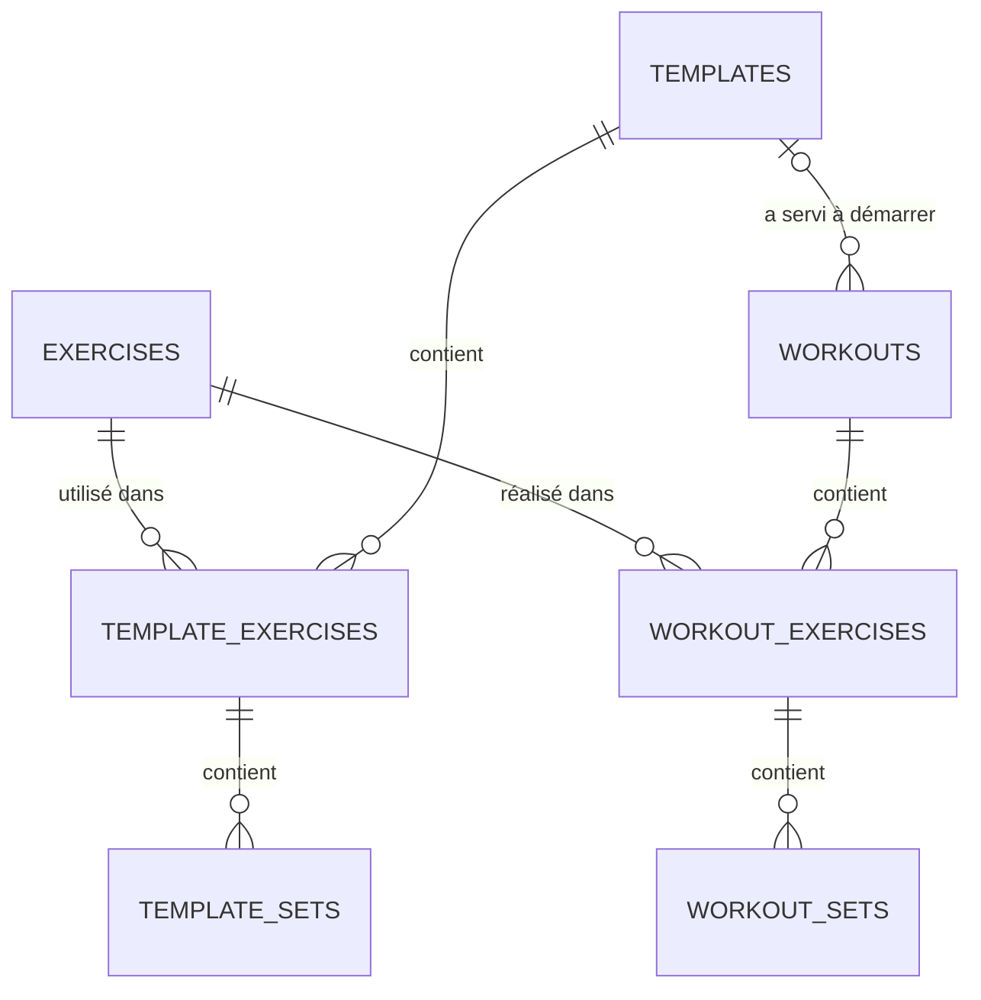

# AppMuscu — Architecture technique et plan de développement

> Statut : **brouillon à valider** · Dernière mise à jour : 2026-09-26
> Exigences référencées (EX-xx, WO-xx…) : voir [SPEC.md](SPEC.md)

---

## 1. Stack technique

| Besoin | Choix | Pourquoi |
|---|---|---|
| Framework | **Flutter** 3.47 (canal stable), Dart 3.13 | Choix du projet. Android uniquement pour l'instant ; la même base de code pourra viser iOS plus tard. |
| Composants UI | **material_ui** | Material Design, sorti du framework Flutter (depuis 3.44) pour devenir un paquet à part. go_router 18 l'utilise déjà. On importe `package:material_ui/material_ui.dart` et **jamais** `package:flutter/material.dart` : les deux définissent des types différents, et les mélanger casse le thème. Les traductions françaises (`GlobalMaterialLocalizations`) sont incluses. |
| État / injection | **Riverpod 3.4** (`flutter_riverpod`), **sans** générateur de code | Standard de fait, testable, s'accorde bien avec les flux réactifs de la base. Sans générateur, il y a moins de « magie » à comprendre. Changements de la v3 à connaître : `AsyncValue.valueOrNull` est supprimé (on utilise `.value`), `StateProvider` est rangé dans `legacy.dart` (on utilise un `Notifier`), et un provider en erreur est relancé automatiquement. |
| Base locale | **Drift** 2.35 (SQLite) + `drift_flutter` | Données relationnelles (séance → exercices → séries), requêtes typées, flux réactifs (`watch`), migrations versionnées. SQLite simplifie la future sync. SQLite lui-même est fourni par `sqlite3` 3.x, téléchargé automatiquement à la compilation (*build hooks*) pour Android et pour les tests sur PC. L'ancien paquet `sqlite3_flutter_libs` est abandonné. |
| Navigation | **go_router** | Package officiel. Tous les écrans sont déclarés à un seul endroit, avec une adresse. `StatefulShellRoute` donne à chaque onglet sa propre pile d'écrans. Ouvrir la séance depuis la notification se fait par une simple adresse. Et c'est prêt pour les redirections de connexion en v2. |
| Notifications | `flutter_local_notifications` + `timezone` | Notification programmée à la fin du repos (RT-05). |
| Vibration | `HapticFeedback` (SDK Flutter), `vibration` si besoin de motifs | RT-05 |
| Identifiants | `uuid` | IDs générés sur l'appareil, compatibles avec une sync (NF-07). |
| Temps | `clock` | Horloge injectable pour tester chronomètre et minuteur. |
| Écran allumé | `wakelock_plus` | ST-04 (Could) |
| Qualité | `flutter_lints`, `flutter_test` | NF-09 |

`build_runner` (génération de code) ne sert qu'à Drift. Chaque dépendance est ajoutée au jalon qui en a besoin, pas avant.

## 2. Architecture de l'application

Organisation **par fonctionnalité** (feature-first), avec 3 couches dans chaque fonctionnalité :

```
presentation  →  domain  ←  data
(widgets,        (modèles,    (tables Drift,
 contrôleurs      règles       DAO,
 Riverpod)        métier)      repositories)
```

```
lib/
├── main.dart
├── app/                    # app.dart (MaterialApp), theme.dart, router.dart (go_router), home_shell.dart (onglets)
├── core/
│   ├── database/           # tables.dart, app_database.dart (+ .g.dart généré), seed/built_in_exercises.dart
│   ├── utils/              # formatage poids/durée, normalisation texte
│   └── widgets/            # composants réutilisables (ex. EmptyState)
└── features/
    ├── exercises/          # bibliothèque (EX)
    │   ├── data/  domain/  presentation/
    ├── workout/            # séance en cours + résumé (WO)
    ├── rest_timer/         # minuteur + notifications (RT)
    ├── templates/          # modèles (TP)
    └── settings/           # réglages (ST)
test/                       # même arborescence que lib/ (+ helpers/ : base de test en mémoire ; drift/ : tests de migration)
drift_schemas/              # structures successives de la base (générées, à committer)
build.yaml                  # configuration de Drift (make-migrations)
```

**Règles d'architecture**

1. L'UI n'accède jamais directement à Drift : elle passe par des *repositories* fournis par Riverpod.
2. Les règles métier (volume, numérotation, Précédent, placeholders, temps de repos effectif, nettoyage de fin de séance, calculs du minuteur) sont des **fonctions Dart pures** dans `domain/`, testables sans Flutter.
3. **La base est la source de vérité.** L'UI observe des flux (`watch`). Une modification est écrite en base, puis l'écran se met à jour tout seul. C'est ce qui garantit WO-21 et NF-02.

### Navigation (go_router)

Toutes les routes sont déclarées dans `lib/app/router.dart`. Le routeur est fourni par `routerProvider` (Riverpod) : il est créé une seule fois par app, et à neuf pour chaque test.

| Route | Écran | Affichage |
|---|---|---|
| `/seance` | Onglet Séance : démarrer, liste des modèles | Onglet 1 |
| `/seance/modeles/nouveau` | Créer un modèle | Onglet 1 |
| `/seance/modeles/:id` | Modifier un modèle | Onglet 1 |
| `…/ajouter`, `…/exercice/:exerciseId` et `…/nouvel-exercice` sous chacune des deux routes précédentes | Sélecteur d'exercices, fiche en lecture seule et création d'exercice, pour l'éditeur de modèle | Onglet 1 |
| `/exercices` | Onglet Exercices : bibliothèque | Onglet 2 |
| `/exercices/nouveau` | Créer un exercice | Onglet 2 |
| `/exercices/:id` | Fiche exercice : onglets À propos / Historique (EX-07) | Onglet 2 |
| `/exercices/:id/modifier` | Modifier un exercice perso | Onglet 2 |
| `/reglages` | Onglet Réglages | Onglet 3 |
| `/seance-en-cours` | Séance en cours | Plein écran, par-dessus les onglets |
| `/seance-en-cours/ajouter` | Sélecteur d'exercices : l'onglet Exercices en mode sélection (`ExercisesScreen.picker`) | Plein écran, renvoie la sélection |
| `/seance-en-cours/nouvel-exercice` | Créer un exercice depuis le sélecteur | Plein écran, renvoie l'identifiant créé |
| `/seance-en-cours/exercice/:exerciseId` | Fiche d'un exercice ouverte pendant la séance (WO-22), sans menu Modifier / Supprimer | Plein écran |
| `/resume/:workoutId` | Résumé de fin de séance | Plein écran |

- Les 3 onglets sont les branches d'un `StatefulShellRoute` : chaque onglet garde ses écrans ouverts quand on passe à un autre et qu'on revient.
- La séance en cours et le résumé sont déclarés **hors** des onglets, sur le navigateur racine. Ils s'affichent donc en plein écran.
- Le sélecteur d'exercices, la fiche en lecture seule et la création d'exercice sont déclarés une seule fois (`_exerciseRoutes` dans `router.dart`) et rattachés sous la séance en cours comme sous l'éditeur de modèle. Le sélecteur est **le même écran que l'onglet Exercices** (`ExercisesScreen.picker(ownerPath:)`) : il reçoit le chemin de l'écran qui l'ouvre, pour y rattacher fiches et création. Chaque usage a ses propres critères de recherche (`exerciseFilterProvider(ExerciseListMode.library / picker)`, `.family` + `.autoDispose`).
- L'aperçu d'un modèle (feuille du bas) s'ouvre sur le navigateur racine (`useRootNavigator: true`), pour passer par-dessus la barre des onglets.
- La barre de séance réduite (WO-20) fait partie de l'écran qui contient les onglets : elle reste visible dans les 3 onglets.
- Toucher la notification de fin de repos ouvre l'adresse `/seance-en-cours` (lien profond).

## 3. Modèle de données



**Conventions**

- `id` : UUID v4 en `TEXT`, clé primaire.
- Horodatages en `INTEGER` (secondes Unix, format par défaut de Drift pour les `DateTime`) : `created_at` et `updated_at` sur toutes les tables racines.
- **Agrégats** : `exercises`, `templates` et `workouts` sont des racines. Elles portent `deleted_at` (suppression douce, RG-10). Leurs enfants (exercices et séries d'un modèle ou d'une séance) sont supprimés physiquement lors d'une édition. **Toute modification d'un enfant met à jour `updated_at` de la racine** : la sync v2 se fera agrégat par agrégat.
- Les énumérations sont des `enum` Dart stockées en `TEXT` sous leur nom Dart (`textEnum`, par exemple `'barbell'`, `'fullBody'`, `'weightReps'`). C'est lisible et ça ne casse pas si on réordonne les valeurs, mais il ne faut **jamais renommer** une valeur existante.

### Tables

**exercises**

| Colonne | Type | Notes |
|---|---|---|
| id | TEXT PK | UUID **fixe** pour les exercices intégrés (pour pouvoir les mettre à jour sans doublon) |
| name | TEXT | |
| name_normalized | TEXT | minuscules, sans accents, pour la recherche (EX-02) et l'unicité (EX-06) |
| equipment | TEXT | `barbell`, `dumbbell`, `machine`, `cable`, `kettlebell`, `bodyweight`, `band`, `other` |
| body_part | TEXT | `chest`, `back`, `shoulders`, `biceps`, `triceps`, `forearms`, `abs`, `quads`, `hamstrings`, `glutes`, `calves`, `fullBody`, `cardio`, `other` |
| tracking_type | TEXT | `weightReps`, `reps`, `duration` |
| default_rest_seconds | INTEGER NULL | préférence : NULL → réglage global, 0 → désactivé (EX-08) |
| weight_unit | TEXT | préférence : `kg` (défaut) ou `lb` (EX-08, RG-14). *Ajoutée en v2* |
| instructions | TEXT NULL | consignes affichées dans la fiche (EX-09). *Colonne `notes` renommée en v2* |
| note | TEXT NULL | note personnelle (EX-11), modifiable depuis la fiche, la séance et l'éditeur de modèle. *Ajoutée en v4* |
| is_custom | BOOLEAN | intégré ou créé par l'utilisateur |
| created_at, updated_at, deleted_at | INTEGER | `deleted_at` = archivé (EX-05) |

**templates** : `id`, `name`, `notes`, `position` (ordre d'affichage), `created_at`, `updated_at`, `deleted_at`.
*La date de dernière utilisation (TP-02) se calcule : `MAX(workouts.started_at) WHERE template_id = …`.*

**template_exercises** : `id`, `template_id` → templates, `exercise_id` → exercises, `position`, `notes`.

**template_sets** : `id`, `template_exercise_id` → template_exercises, `position`, `set_type`, `weight_kg` REAL NULL, `reps` INTEGER NULL, `duration_seconds` INTEGER NULL, `rest_seconds` INTEGER NULL.

**workouts**

| Colonne | Type | Notes |
|---|---|---|
| id | TEXT PK | |
| name | TEXT | |
| template_id | TEXT NULL → templates | modèle d'origine (TP-05, TP-07) |
| started_at | INTEGER | |
| ended_at | INTEGER NULL | **NULL = séance en cours** |
| notes | TEXT NULL | |
| created_at, updated_at, deleted_at | INTEGER | |

**workout_exercises** : `id`, `workout_id` → workouts, `exercise_id` → exercises, `position`, `notes` (plus utilisée depuis la v4 : la note est celle de l'exercice).

**workout_sets**

| Colonne | Type | Notes |
|---|---|---|
| id | TEXT PK | |
| workout_exercise_id | TEXT → workout_exercises | |
| position | INTEGER | ordre dans l'exercice |
| set_type | TEXT | toujours `normal` depuis le retrait des types de série (SPEC D12). Les valeurs `warmup`, `dropset` et `failure` restent prévues dans l'enum |
| weight_kg | REAL NULL | |
| reps | INTEGER NULL | |
| duration_seconds | INTEGER NULL | |
| rest_seconds | INTEGER NULL | temps de repos propre à la série. NULL → défaut de l'exercice → réglage global (RG-09) |
| completed_at | INTEGER NULL | **NULL = non validée** |
| planned_weight_kg, planned_reps, planned_duration_seconds | REAL / INTEGER NULL | valeurs prévues par le modèle, copiées au démarrage (TP-05) : placeholders (RG-11). *Ajoutées en v3* |

**settings** (clé/valeur) : réglages (`default_rest_seconds`, `rest_sound`, `rest_vibration`, `keep_screen_on`, `theme` ; clé absente = valeur par défaut) **et** état du minuteur (`rest_set_id`, `rest_ends_at`, `rest_total_seconds`) pour qu'il survive à l'arrêt de l'app et se réaffiche sous la bonne série (RT-03, RT-06).

### Index et contraintes

- Index sur `workout_exercises(exercise_id)`, `workout_exercises(workout_id)`, `workout_sets(workout_exercise_id)`, `workouts(started_at)`.
- **Index unique partiel** sur `exercises(name_normalized) WHERE deleted_at IS NULL` : deux exercices actifs ne peuvent pas porter le même nom (EX-06), même si le code applicatif oubliait de le vérifier.
- **Index unique partiel** garantissant une seule séance en cours (WO-02). Il a été testé avec SQLite 3.45 : une 2e séance en cours est bien refusée.
  `CREATE UNIQUE INDEX one_active_workout ON workouts((1)) WHERE ended_at IS NULL AND deleted_at IS NULL;`
- Clés étrangères `ON DELETE CASCADE` des enfants vers leurs parents.

### Requête « Précédent » (RG-03, RG-04)

```sql
-- 1. Occurrence de l'exercice dans la séance de référence
SELECT we.id
FROM workout_exercises we
JOIN workouts w ON w.id = we.workout_id
WHERE we.exercise_id = :exerciseId
  AND w.ended_at IS NOT NULL
  AND w.deleted_at IS NULL
  AND EXISTS (SELECT 1 FROM workout_sets s
              WHERE s.workout_exercise_id = we.id AND s.completed_at IS NOT NULL)
ORDER BY w.started_at DESC, we.position ASC
LIMIT 1;

-- 2. Ses séries validées, dans l'ordre → la k-ième alimente la ligne k
SELECT * FROM workout_sets
WHERE workout_exercise_id = :id AND completed_at IS NOT NULL
ORDER BY position;
```

## 4. Points techniques clés

### Séance en cours (WO)
- Au démarrage, la séance est créée en base avec `ended_at = NULL`. Chaque action (ajout de série, saisie, validation) est écrite immédiatement.
- L'écran observe **un seul flux** avec l'arbre complet : séance → exercices (+ infos bibliothèque + Précédent) → séries.
- ⚠️ **Piège classique :** si le flux reconstruit un champ texte pendant la frappe, le curseur saute. Chaque champ a donc son propre `TextEditingController`, jamais écrasé par le flux tant qu'il a le focus. L'écriture en base se fait avec un court délai (~300 ms) et à la perte du focus.

### Minuteur de repos (RT)
Code : `lib/features/rest_timer/` (domain : `RestTimer`, `effectiveRestSeconds` ; data : `RestTimerRepository`, `RestNotifications` ; presentation : `RestTimerController`, `RestLine`).

- L'état tient en trois valeurs : `setId` (la série validée, sous laquelle s'affiche le décompte), `endsAt` (heure de fin absolue) et `totalSeconds`. Elles sont enregistrées dans la table `settings` (clés `rest_*`), si bien que le minuteur survit à l'arrêt de l'app (RT-06). Le temps restant = `endsAt − maintenant`, recalculé chaque seconde par `clockTickProvider`, qui ne sert qu'à l'affichage.
- **Durée** : au moment de la validation, on calcule le temps de repos effectif de la série (RG-09 : série → exercice → réglage global de 2:00) et on le fige dans `totalSeconds`.
- **Affichage (RT-03)** : chaque série est suivie d'un widget `RestLine`. Son état se déduit sans rien stocker de plus : minuteur sur cette série et pas encore écoulé → **en cours** ; série validée → **terminé** ; sinon → **prévu**.
- **Démarrer** (validation d'une série) : on enregistre l'état, puis on programme une notification locale à `endsAt`, exprimée en UTC, ce qui évite de dépendre du fuseau du téléphone. L'identifiant est fixe, donc un nouveau repos remplace la notification précédente. **Arrêter** (dévalidation, suppression de la série, retrait de l'exercice, fin ou abandon de la séance) : on efface l'état et on annule la notification.
- **Fin du repos** : c'est toujours la notification qui prévient, que l'app soit ouverte ou non, avec l'importance maximale (son et vibration, affichage en haut de l'écran). Il n'y a donc ni double alerte ni code de vibration à part.
- **Android** : `POST_NOTIFICATIONS` est demandée au lancement de l'app (après le premier écran, dans `AppMuscu.initState`). Les **alarmes exactes** passent par `USE_EXACT_ALARM`, accordée d'office à partir d'Android 13 et adaptée à une app de minuteur publiée hors Play Store. `SCHEDULE_EXACT_ALARM` sert pour Android ≤ 12L. Si les alarmes exactes sont refusées, la notification est programmée en mode inexact, donc peut-être en retard. Le manifeste déclare le `ScheduledNotificationReceiver` du plugin. Gradle active le *core library desugaring*, requis par le plugin.
- ⚠️ **Xiaomi / HyperOS gèle l'app en arrière-plan** (constaté le 2026-09-26 sur le Redmi Note 13 Pro). Une dizaine de secondes après le passage en arrière-plan, `GreezeManager` gèle l'app (`FZ uid=… reason=tobg`). L'alarme de fin de repos est alors **mise de côté** (`cached alarm!`) et n'est livrée qu'à la réouverture de l'app. La notification n'arrive donc que si l'app est au premier plan. Pistes, de la plus simple à la plus solide : réglage « Économiseur de batterie → Aucune restriction » (docs/INSTALLATION.md, Dépannage) ; programmer la fin du repos comme un réveil (`AndroidScheduleMode.alarmClock`) ; une notification permanente pendant le repos (*foreground service*), que HyperOS ne gèle pas. Voir https://dontkillmyapp.com.
- **Toucher la notification (RT-10)** : `RestNotifications.listenToTaps(onTap)`, appelé par `AppMuscu` au premier affichage. Le plugin prévient quand on touche la notification app ouverte ou en arrière-plan (`onDidReceiveNotificationResponse`) ; au lancement, `getNotificationAppLaunchDetails()` dit si c'est ce geste qui a démarré l'app. `AppMuscu` pousse alors `/seance-en-cours`, sauf s'il n'y a pas de séance en cours ou si elle est déjà affichée (`router.state.matchedLocation` : l'écran en haut de la pile, y compris ceux ouverts par `push`, contrairement à `currentConfiguration.uri`).
- **Son et vibration (ST-02)** : Android fige le son et la vibration d'un canal de notifications à sa création. Il y a donc un canal par combinaison (`rest_timer`, `rest_timer_sound`, `rest_timer_vibration`, `rest_timer_silent`), choisi au moment de programmer la notification d'après les réglages.
- Tests : `testApp()` remplace les notifications par `FakeRestNotifications` (test/helpers), qui note les appels (avec son et vibration) ; `notificationsOf(tester)` la récupère, et `tap()` simule un toucher.

### Séance réduite et compteur compact (WO-20, RT-08)
- `ActiveWorkoutBar` est placée dans `HomeShell`, au-dessus de la `NavigationBar` : elle suit donc les trois onglets. Elle n'affiche rien sans séance en cours. `RestCountdown` (« ⏱ 1:12 ») et `RestProgressLine` (rest_timer/presentation) se masquent d'eux-mêmes quand aucun repos ne tourne.
- L'écran de séance est un `SingleChildScrollView` construit en entier (quelques dizaines de séries au plus), plutôt qu'une liste paresseuse : la ligne du repos en cours existe même hors de l'écran. Elle reçoit une `GlobalKey`. Après chaque image et à chaque défilement, on compare sa position à la zone visible : hors de l'écran → compteur dans l'en-tête. Le toucher, ou rouvrir la séance pendant un repos, appelle `Scrollable.ensureVisible` sur cette clé.

### Réglages (ST)
- `SettingsRepository` : une clé par réglage dans la table `settings`, un `StreamProvider` par réglage. Pour la notification, `readRestAlert()` fait une simple lecture (`get`).
- **Thème (ST-03)** : `main()` crée le conteneur Riverpod (`ProviderContainer`) et lit le thème **avant** `runApp` (`UncontrolledProviderScope`) : pas de flash clair → sombre au démarrage. Délai maximal d'une seconde, sinon thème du système.
- **Écran allumé (ST-04)** : par un **canal de plateforme** (`MethodChannel('appmuscu/screen')`, lib/core/platform/screen_awake.dart). Dart envoie `keepOn(true/false)`, et `MainActivity.kt` pose ou retire `FLAG_KEEP_SCREEN_ON` sur la fenêtre. Pas de dépendance à ajouter. `AppMuscu` écoute (`ref.listenManual`) « réglage activé ET séance en cours ». Les tests utilisent `FakeScreenAwake` (`screenAwakeOf(tester)`).
- **Note d'exercice (EX-11)** : `editExerciseNote` et `ExerciseNoteText` (exercises/presentation/exercise_note.dart), partagés par la séance, l'éditeur de modèle et la fiche. Dans l'éditeur, la note est écrite tout de suite (elle n'appartient pas au brouillon du modèle) et relue par `exerciseProvider`.

### Modèles (TP)
Code : `lib/features/templates/` (domain : `TemplateDetails`, `TemplateDraft`, `workoutDiffersFromTemplate`, `templatePreview` ; data : `TemplateRepository` ; presentation : `TemplateSection`, `TemplateEditorScreen`).

- **Éditeur = brouillon en mémoire.** Contrairement à la séance, écrite à chaque saisie, un modèle est modifié dans un `TemplateDraft` (objets Dart modifiables) et enregistré d'un bloc par « Enregistrer ». `saveTemplate` travaille dans une **transaction** : il remplace le nom, supprime les exercices du modèle (leurs séries partent avec, clé étrangère `ON DELETE CASCADE`) et réinsère tout le contenu. Un `PopScope` bloque le retour tant qu'il reste des modifications et demande confirmation.
- **Widgets partagés avec la séance** : `SetColumns` (colonnes « Précédent » et ✓ facultatives), `SetInputField` et `setFieldsOf` (champs selon le type de suivi), `PlainRestLine` et `showRestPicker` (ligne et choix du repos), `SwipeDeleteBackground`, `showConfirmDialog`.
- **Démarrer (WO-01, TP-05)** : il n'y a plus de séance vide. `WorkoutRepository.startWorkout(templateId)` copie, dans une transaction, les exercices et les séries du modèle. Les kg/reps/durées prévus vont dans les colonnes `planned_*` de `workout_sets` : la séance ne dépend plus du modèle ensuite (modifié ou supprimé). `placeholdersOf` (domain) applique RG-11 champ par champ : prévu, sinon Précédent.
- **Liste (TP-02)** : une seule requête (modèles → exercices → séries) avec une **sous-requête corrélée** pour la dernière utilisation : `MAX(workouts.started_at)` des séances terminées du modèle. Drift surveille aussi les tables de la sous-requête : la carte se met à jour quand une séance se termine.
- **Fin de séance (TP-07)** : le résumé compare les séries validées au modèle (`workoutDiffersFromTemplate` : exercices et ordre, nombre de séries, valeurs du type de suivi, repos). « Mettre à jour le modèle » = `saveTemplate` avec `TemplateDraft.fromWorkout`.
- **Réorganiser (WO-15, TP-01, TP-08)** : `ReorderList` (core/widgets), partagé par la séance, l'éditeur et la liste des modèles (qui gère elle-même son défilement pour pouvoir laisser la place à la liste de réorganisation), remplace la liste tant que le mode est actif : une ligne par exercice dans un `ReorderableListView`, poignée ≡ (`ReorderableDragStartListener`, immédiat) ou appui long sur la ligne. Côté séance, l'ordre affiché est gardé en mémoire (`_order`) pendant que `reorderExercises` réécrit les positions : pas de saut en attendant la base.

### Migrations (NF-08)

La base installée sur le téléphone doit évoluer **sans perte de données** à chaque nouvelle version de l'app. On utilise l'outil officiel de Drift :

1. Modifier `tables.dart`, puis incrémenter `schemaVersion` dans `app_database.dart`.
2. `dart run build_runner build`, puis `dart run drift_dev make-migrations`. L'outil :
   - enregistre la nouvelle structure dans `drift_schemas/app_database/drift_schema_vN.json` (à committer) ;
   - génère `app_database.steps.dart`, dont la fonction `stepByStep(fromXToY: …)` donne accès à chaque version de la structure ;
   - génère `test/drift/app_database/` : tests qui vérifient que chaque migration aboutit **exactement** à la structure d'une base neuve.
3. Écrire l'étape `fromXToY` dans `app_database.dart` et compléter le test d'intégrité des données dans `test/drift/app_database/migration_test.dart`.

Configuration dans `build.yaml`. Historique des versions :

| Version | Changement |
|---|---|
| v1 | Structure initiale (M1) |
| v2 | Fiche exercice : `notes` → `instructions`, ajout de `weight_unit`, consignes des 10 exercices intégrés |
| v3 | Modèles : ajout de `planned_weight_kg`, `planned_reps`, `planned_duration_seconds` à `workout_sets` |
| v4 | Note d'exercice : ajout de `exercises.note`, remplie avec la note de séance la plus récente de chaque exercice |

### Bibliothèque initiale (EX-01)
- `lib/core/database/seed/built_in_exercises.dart` contient les 10 exercices de [SPEC §5.1](SPEC.md#51-bibliothèque-dexercices-ex), insérés au premier lancement (`onCreate`). On a choisi un fichier Dart plutôt que JSON : les valeurs d'enum sont vérifiées à la compilation, et il n'y a aucun fichier à charger. Chaque exercice a un **UUID fixe**, ce qui permet aux versions suivantes d'ajouter ou corriger des exercices intégrés, par une migration, sans créer de doublons.

### Sauvegarde
- Pas d'export dans le MVP. La **sauvegarde automatique d'Android** (Auto Backup, activée par défaut) copie les données de l'app sur le compte Google du téléphone : jusqu'à 25 Mo, environ une fois par jour, en Wi-Fi et en charge. Elle les restaure si l'app est réinstallée ou si on change de téléphone.
- ✅ Vérifié au M1 : `drift_flutter` range `appmuscu.sqlite` dans `getApplicationDocumentsDirectory()`, c'est-à-dire `/data/data/com.maxime.app_muscu/app_flutter/` sur Android (un dossier créé par `Context.getDir`). Auto Backup l'inclut par défaut, et le manifeste ne désactive pas `allowBackup`.

## 5. Stratégie de test

| Niveau | Quoi | Outil |
|---|---|---|
| Unitaire (domaine) | Volume, numérotation, placeholder, temps de repos effectif, nettoyage de fin de séance, calculs du minuteur, différences séance / modèle, brouillon de modèle | `test` + horloge factice (`clock`) |
| Unitaire (données) | Requête Précédent, contrainte « une seule séance en cours », suppression douce, migrations, seed, enregistrement des modèles et démarrage depuis un modèle | Drift en mémoire (`NativeDatabase.memory()`) |
| Widget | Parcours complets à travers l'app : chercher et créer un exercice (M2) ; ajouter un exercice → remplir une série → valider → la ligne de repos sous la série passe « en cours » (M3-M4) ; créer un modèle → le démarrer → le mettre à jour depuis le résumé, réorganiser par glisser-déposer (M5) | `flutter_test` + `testApp()`, `checkExercise()`, `dragUp()` (test/helpers/pump_app.dart), `addWorkout()`, `addTemplate()` et `addEmptyTemplate()` (test/helpers/test_database.dart). Les tests de la séance démarrent d'un modèle vide, « Séance libre » |

**Pièges des tests de widgets avec Drift**, gérés par `testApp()` :
- l'app doit être **démontée à l'intérieur du test**, suivi d'un `pump(Duration.zero)`. Drift ferme ses flux avec un minuteur de durée nulle, sinon le test échoue avec « A Timer is still pending » ;
- ne jamais appeler `tester.pumpWidget` dans un `addTearDown` : le test reste bloqué ;
- une liste n'affiche que ses éléments visibles, donc l'écran de test fait 360 × 1200 dp ;
- lancer les tests avec `flutter test --timeout 60s`, pour qu'un test bloqué échoue vite au lieu d'attendre 10 minutes ;
- les chronomètres passent par `clockTickProvider`, que `testApp()` remplace par un flux immobile : sinon `pumpAndSettle` ne se termine jamais ;
- `tester.pageBack()` cherche le bouton retour de `flutter/material`, pas celui de `material_ui` : il faut utiliser `tester.tap(find.byType(BackButton))` ;
- après `enterText`, faire un `pump()` avant un geste qui dépend de l'écran redessiné (ex. le retour bloqué par `PopScope` dès la première modification) : sinon le geste part dans la même image, avec l'ancien état.
| Manuel (téléphone) | Minuteur écran verrouillé, app tuée en pleine séance, reprise | Checklist à chaque jalon |

## 6. Environnement de développement (Windows)

Un guide pas à pas sera donné au jalon M0. En résumé :

1. Installer le **SDK Flutter** (stable), l'ajouter au `PATH`, puis lancer `flutter doctor`.
2. Installer **Android Studio**, qui fournit le SDK Android et les outils de compilation, puis `flutter doctor --android-licenses`.
3. Dans VS Code : extensions **Flutter** et **Dart**.
4. Activer le **débogage USB** sur le téléphone Android et le brancher au PC. L'app s'y installe directement, avec le *hot reload* : les modifications du code apparaissent en une seconde, sans réinstaller.
5. `git init` avec le `.gitignore` généré par Flutter.

## 7. Plan de développement

Chaque jalon se termine par quelque chose de **testable sur le téléphone**. À chaque étape, j'écris le code et j'explique les nouveaux concepts, puis tu testes sur ton téléphone.

| Jalon | Contenu | Exigences | Concepts Flutter / Dart découverts | Résultat testable |
|---|---|---|---|---|
| **M0 — Setup** ✅ | Installation, `flutter create`, lints, arborescence, thème clair/sombre, 3 onglets vides avec go_router, git | — | Bases de Dart, widgets, `StatelessWidget` / `StatefulWidget`, *hot reload*, `Scaffold`, `NavigationBar`, routes go_router et `StatefulShellRoute` | L'app démarre sur le téléphone avec 3 onglets |
| **M1 — Données** ✅ | Schéma Drift, index, seed des 10 exercices, repositories, tests unitaires | NF-07, NF-08, RG-* | Classes Dart, `async` / `Future` / `Stream`, SQL avec Drift, génération de code, tests unitaires | Tests verts |
| **M2 — Exercices** ✅ | Liste, recherche, filtres, création / édition / archivage ; fiche exercice (À propos, Historique, préférences kg/lb et repos) ; migration v1 → v2 | EX-01 → EX-10 | `ListView`, formulaires et validation, routes avec paramètres (`/exercices/:id`), Riverpod (providers, `Notifier`, `.family`), onglets (`TabBar`), migrations de base | Parcourir, chercher, créer des exercices, consulter leur fiche |
| **M3 — Séance** ✅ (WO-16 abandonnée ; WO-15 fait au M5 ; WO-20 au M6) | Séance vide (retirée au M5), séries, Précédent, validation, fin, résumé, reprise après arrêt | WO-01 → WO-21 (M/S) | État complexe, flux de la base dans l'UI (`StreamProvider`), `TextEditingController`, gestes (balayage, glisser-déposer), dialogues | 🏋️ **Première vraie séance à la salle** |
| **M4 — Minuteur** ✅ | Ligne de repos sous chaque série, temps de repos par série, notification de fin de repos (compteur compact RT-08 reporté au M6) | RT-01 → RT-07 | Interfaces et fausses implémentations pour les tests, permissions Android, notifications locales programmées, configuration Gradle et manifeste | Repos notifié téléphone verrouillé |
| **M5 — Modèles** ✅ | Création, modification, duplication, suppression, démarrer depuis un modèle (aperçu puis « Démarrer »), mise à jour depuis le résumé ; plus de séance vide ; sélecteur = onglet Exercices ; réorganiser par glisser-déposer ; migration v2 → v3 | TP-01 → TP-07 (sauf TP-06, supprimée), WO-15 | Réutiliser des widgets, transactions en base, sous-requêtes, brouillon en mémoire et `PopScope`, renvoyer un résultat d'un écran | Lancer « Push » depuis l'onglet Séance |
| **M6 — Réglages et finitions** ✅ | Réglages, séance réduite, compteur compact du repos, note d'exercice ; migration v3 → v4. *L'APK release est reporté (D15).* | ST-01 → ST-04, WO-20, RT-08, EX-11 | Thèmes, préférences, conteneur Riverpod créé avant `runApp`, canal de plateforme (Dart ↔ Kotlin), `GlobalKey` et `Scrollable.ensureVisible` | Séance réduite pendant qu'on consulte une fiche ; réglages appliqués |
| **M7 — Dernières idées** ✅ | Réordonner les modèles, repos enregistré comme défaut de l'exercice, notification qui ouvre la séance. Pas de note de séance (D16) | TP-08, RT-09, RT-10 | Widget générique réutilisé (`ReorderList`), lien profond depuis une notification, pile de navigation go_router (`router.state`) | Toucher « Repos terminé » ramène à la séance |

## 8. Risques

| Risque | Conséquence | Parade |
|---|---|---|
| Notification de repos en retard (alarmes exactes, économie de batterie Android) | Minuteur peu fiable écran éteint | Permission alarmes exactes, sinon plan B *foreground service* (§4) |
| Champs reconstruits pendant la frappe | Curseur qui saute, valeurs perdues | Contrôleurs texte locaux + écriture différée (§4) |
| Téléphone perdu ou cassé | Séances perdues | Sauvegarde automatique Android (§4). Export manuel en v2 |
| Courbe d'apprentissage Flutter (débutant) | Blocages, découragement | Jalons courts, un seul nouvel outil à la fois, explications à chaque étape |
